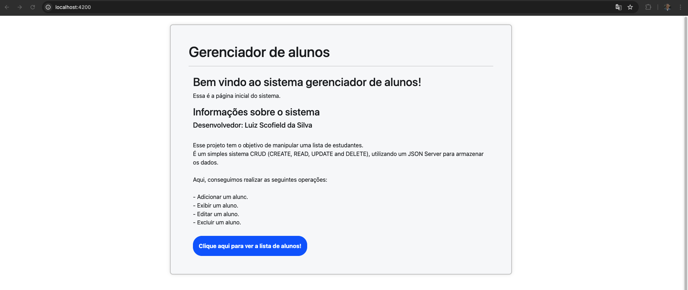
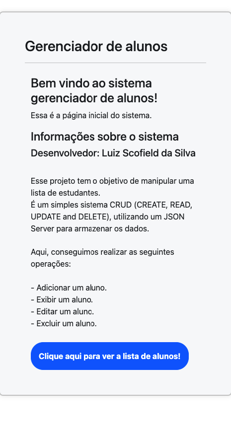
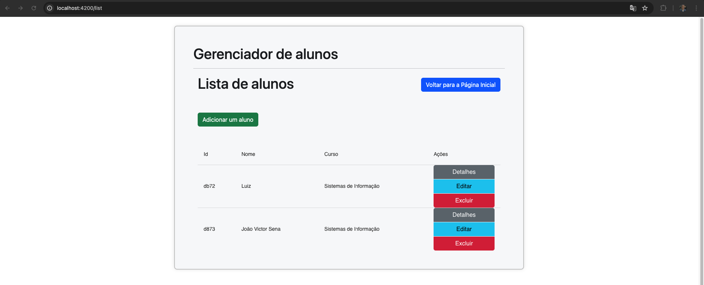
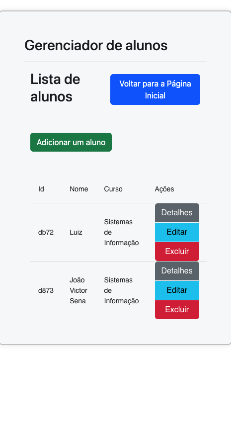
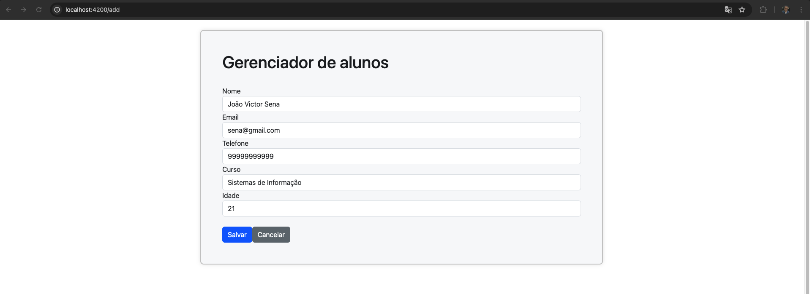
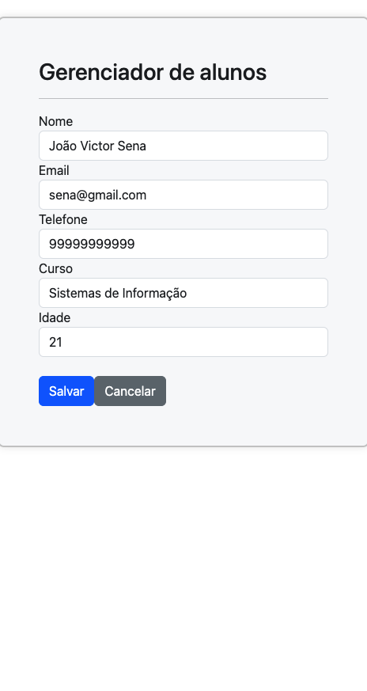
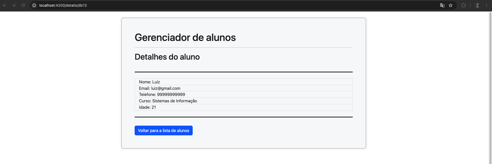
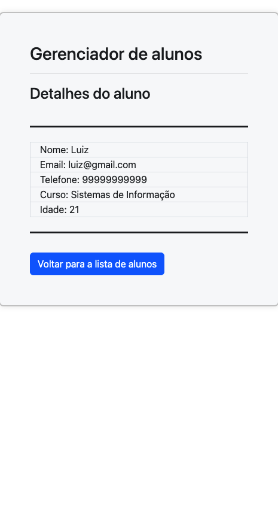

# Gerenciador de alunos

Projeto construído com a versão 18.0.4 do Angular.
Essa aplicação é um sistema gerenciador simples de alunos. É um sistema CRUD (create, read, update and delete), portanto, podemos adicionar, exibir, editar e excluir alunos do sistema.
Foi utilizado angular como linguagem para o projeto, JSON server para simular uma API restful como backend, além de angular material e bootstrap para estilização das páginas.

## Servidor de desenvolvimento

Use o comando `ng serve` para executar a aplicação localmente. Acesse a URL `http://localhost:4200/` no seu navegador para interagir com o sistema.

## JSON Server

Essa aplicação utiliza um JSON Server para armazenar as informações dos alunos.
Use o comando `npx json-server --watch db.json --port 3000` para iniciar o JSON Server.

## Screenshots
### Homepage (computador)

### Homepage (celular)

### Lista de alunos (computador)

### Lista de alunos (celular)

### Adicionar alunos (computador)

### Adicionar alunos (celular)

### Ver aluno (computador)

### Ver aluno (celular)

